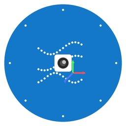

# Sensor Data Collector

A comprehensive Flutter application for collecting and recording sensor data from mobile devices, with support for IMU sensors, device orientation, and ARKit VIO (Visual-Inertial Odometry) tracking.

<div align="center">
  
</div>

## Features

### 📱 Multi-Sensor Data Collection
- **Accelerometer**: Measures device acceleration in 3D space
- **Gyroscope**: Measures device rotation rate
- **Magnetometer**: Measures magnetic field strength
- **Motion/Orientation**: Device orientation (yaw, pitch, roll)
- **ARKit VIO**: Camera position and rotation in 3D space (iOS only)

### ⚡ Native iOS Sensor Performance Modes
- **UI Mode** (~15Hz): Optimized for UI updates
- **Normal Mode** (~5Hz): Standard sensor sampling rate
- **Game Mode** (~50Hz): High-frequency sampling for gaming applications
- **Fastest Mode**: Maximum possible sensor sampling rate

### 💾 Data Export
- Real-time CSV data recording
- Timestamped sensor readings
- Synchronized data collection across all sensors
- Files saved to app documents directory

### 🚀 ARKit Integration
- 6DOF (6 Degrees of Freedom) camera tracking
- Real-time position and orientation data
- Visual-inertial odometry for accurate motion tracking
- Camera view with AR scene visualization

## Screenshots

The app provides real-time sensor data visualization and recording capabilities with an intuitive interface for controlling data collection.

## Technical Specifications

### Dependencies
- `sensors_plus: ^4.0.2` - Cross-platform sensor access
- `motion_sensors: ^0.1.0` - Device orientation data
- `arkit_plugin: ^1.1.2` - ARKit integration for iOS
- `permission_handler: ^11.4.0` - Runtime permissions
- `path_provider: ^2.0.15` - File system access
- `csv: ^5.1.1` - CSV file generation

### Platform Support
- **iOS**: Full feature support including ARKit VIO
- **Android**: IMU sensors and orientation (ARKit VIO not available)

### Requirements
- Flutter 3.3.1 or higher
- iOS 11.0+ (for ARKit features)
- Camera and sensor permissions

## Installation

1. Clone this repository:
   ```bash
   git clone <repository-url>
   cd flutter_application_1
   ```

2. Install dependencies:
   ```bash
   flutter pub get
   ```

3. Run the app:
   ```bash
   flutter run
   ```

## Usage

1. **Select Sensor Speed**: Choose from UI, Normal, Game, or Fastest sampling rates
2. **Start Recording**: Tap "Start Recording" to begin data collection
3. **Monitor Data**: View real-time sensor readings on screen
4. **Stop Recording**: Tap "Stop Recording" to save data to CSV file
5. **Access Files**: CSV files are saved in the app's documents directory

## Data Format

The exported CSV files contain the following columns:
- `timestamp` - Unix timestamp in milliseconds
- `accel_x`, `accel_y`, `accel_z` - Accelerometer data (m/s²)
- `gyro_x`, `gyro_y`, `gyro_z` - Gyroscope data (rad/s)
- `mag_x`, `mag_y`, `mag_z` - Magnetometer data (µT)
- `orientation_yaw`, `orientation_pitch`, `orientation_roll` - Device orientation (radians)
- `ar_camera_x`, `ar_camera_y`, `ar_camera_z` - ARKit camera position (meters)
- `ar_rotation_x`, `ar_rotation_y`, `ar_rotation_z`, `ar_rotation_w` - ARKit camera rotation quaternion

## Development

### Custom App Icon
The app includes a custom-designed icon featuring:
- Gradient background (blue to teal)
- Sensor wave patterns
- ARKit camera symbol
- 3D coordinate axes (X, Y, Z)

### Architecture
- Event-driven sensor data collection
- Synchronized sensor streams with configurable sampling rates
- Real-time ARKit integration with camera tracking
- Efficient data buffering and CSV export

## Contributing

Contributions are welcome! Please feel free to submit a Pull Request.

## License

This project is licensed under the MIT License - see the LICENSE file for details.
